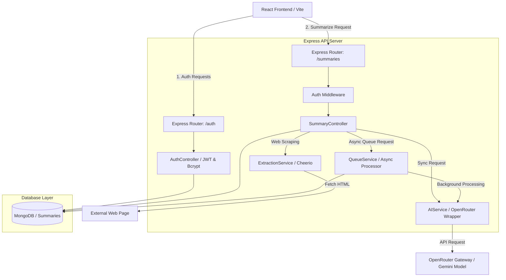

# 🧠 AI-Powered Text & Article Summarizer (Full-Stack MERN)

A production-ready, full-stack web application designed to combat information overload by distilling lengthy text files, copied paragraphs, and remote web articles into highly customizable, coherent AI summaries. 

Built with **React, Node.js, Express, MongoDB, and OpenRouter AI**, this system is engineered with performance, scalability, security, and clean architecture in mind—making it a perfect case study for modern full-stack engineering.

---

## 🏗️ System Architecture & Data Flow

Below is the design of the application's request processing pipeline:



---

## ⚡ Highlighted Features (Interview Talking Points)

### 1. Dual Summarization Pipelines (Sync & Async)
The backend implements two distinct pipelines to optimize resource consumption and prevent server connection drops:
*   **Synchronous Mode (`/summaries/generate`)**: Processes text up to 5,000 words in real-time, sending immediate responses to the client.
*   **Asynchronous Mode (`/summaries/queue`)**: Handles massive documents by offloading processing to an event-driven background `QueueService`. It generates a unique `jobId`, allowing the client to poll the status (`/summaries/job/:jobId`) asynchronously.
*   *Scale-Out Architecture*: Designed as an interface-based architecture, the current in-memory queue can easily be swapped for **BullMQ + Redis** in a production environment with zero changes to controller logic.

### 2. Intelligent Web Article Scraper (`ExtractionService`)
Instead of expecting copy-pasted text, users can paste any URL. The application uses a custom scraper built with `Cheerio` and `Axios`:
*   Filters out non-content clutter by stripping elements like `<script>`, `<style>`, `<nav>`, `<header>`, `<footer>`, `<aside>`, and `<iframe>`.
*   Applies a priority heuristic selector (`article`, `[role="main"]`, `.content`, `main`, etc.) to isolate the core article body.
*   Falls back to body text parsing if semantic tags are missing.
*   Sanitizes spacing, runs character validation, and returns clean readable paragraphs.

### 3. API Resilience & Cooldown Engine
AI service wrappers are prone to API rate limits. The `AIService` includes resilient gateway measures:
*   **Strict Cooldown**: Enforces a minimum 2-second delay between requests from the same server node.
*   **Rate-Limit Adaptation**: Detects `429 Too Many Requests` response headers from OpenRouter, dynamically reading the `retry-after` header and locking out requests until the cooldown window resets.
*   **API Key Sanitizer**: Safely strips whitespace, double quotes, and single quotes from process variables and validates structure before invoking remote requests.

### 4. Advanced Frontend UX & Live Dashboard
The UI/UX is built to feel clean, high-end, and dynamic:
*   **Interactive Analytics Dashboard**: Showcases aggregate performance metrics, including total summaries created, total original/summarized words processed, and space-saved statistics using custom mathematical compression ratios (`((summaryLength / originalLength) * 100).toFixed(2)`).
*   **Global State Management**: Utilizes `Zustand` for state synchronization across the dashboard, history logs, and summarization views, eliminating prop-drilling.
*   **Smooth Animations & Toasting**: Integrates `Framer Motion` and `React-Toastify` for polished visual feedback, interactive hover states, and alerts.

---

## 🛠️ Technology Stack

| Layer | Component | Technologies Used |
| :--- | :--- | :--- |
| **Frontend** | Framework & Bundler | React 18, Vite |
| | Styling & Icons | Tailwind CSS, Lucide React, CSS Variables |
| | State Management | Zustand |
| | Routing | React Router DOM v6 |
| **Backend** | Runtime Environment | Node.js (>=20), Express.js |
| | Web Scraper | Cheerio, Axios |
| | Request Validation | Joi |
| | Authentication | JWT (JSON Web Tokens), Bcryptjs |
| **Database** | Database Engine | MongoDB Atlas, Mongoose ODM |
| | Dev Tools | Concurrently (runs React + Express together) |

---

## 🗄️ Database Schema Design

The system relies on two core schemas in MongoDB:

### 1. `User` Schema
```javascript
{
  name: { type: String, required: true },
  email: { type: String, required: true, unique: true },
  password: { type: String, required: true },
  createdAt: { type: Date, default: Date.now }
}
```

### 2. `Summary` Schema
Tracks structural context to calculate analytical insights for the user dashboard.
```javascript
{
  title: { type: String, required: true },
  originalText: { type: String, required: true },
  summarizedText: { type: String, required: true },
  createdBy: { type: Schema.Types.ObjectId, ref: 'User', required: true },
  createdAt: { type: Date, default: Date.now }
}
```

---

## 📡 Core API Routes

### Authentication (`/auth`)
*   `POST /auth/signup` - Register a new user account.
*   `POST /auth/login` - Authenticate credentials and receive a JWT.

### Summaries (`/summaries`) - *Requires JWT*
*   `POST /summaries/generate` - Real-time AI text summarization.
*   `POST /summaries/generate/url` - Instantly scrape a URL and summarize its content.
*   `POST /summaries/queue` - Offload summary generation to the background queue.
*   `GET /summaries/job/:jobId` - Check status of an asynchronous job.
*   `GET /summaries/queue/stats` - Monitor background worker statistics.
*   `POST /summaries` - Save a generated summary to the user's history database.
*   `GET /summaries` - Retrieve all summaries for the authenticated user.
*   `GET /summaries/stats` - Fetch overall metrics (word counts, average compression ratio).
*   `GET /summaries/:id` - Fetch details of a single summary.
*   `PUT /summaries/:id` - Update saved title or summary content.
*   `DELETE /summaries/:id` - Remove summary record from the dashboard.

---

## 🚀 Installation & Setup

1.  **Clone the Repository**:
    ```bash
    git clone https://github.com/shambhuraj0007/Article-Summarizer.git
    cd Article-Summarizer
    ```

2.  **Install Dependencies**:
    ```bash
    npm install
    ```

3.  **Environment Setup**:
    Create a `.env` file in the root folder and add the following keys:
    ```env
    PORT=8080
    NODE_ENV=development
    MONGO_URI=your_mongodb_connection_string
    JWT_SECRET=your_jwt_signing_key
    OPENROUTER_API_KEY=your_openrouter_api_key
    SITE_NAME=SummarizerApp
    SITE_URL=http://localhost:5173
    ```

4.  **Run in Development Mode**:
    Starts both the Express API backend (Port `8080`) and Vite Dev Server (Port `5173`) concurrently:
    ```bash
    npm run dev
    ```

---

## 💡 Potential Interview Questions & Answers

### Q1: Why did you implement an asynchronous background queue for summarization instead of just processing all requests synchronously?
> **Answer**: High-volume or heavy document text processing can easily block the single-threaded Node.js event loop or exceed the HTTP response timeout limits of cloud platforms (like Vercel serverless functions, which timeout after 10–15 seconds on free tiers). By decoupling heavy jobs to a background queue processor, the server responds instantly with a `jobId` (`202 Accepted`), providing a fast, non-blocking, and scale-ready system.

### Q2: How does the web extraction service target article bodies accurately while avoiding ads, sidebars, and nav links?
> **Answer**: It utilizes a customized parser with `Cheerio`. First, it removes clutter elements (tags like `script`, `style`, `nav`, `header`, `footer`, `aside`, `iframe`). Then, it iterates through a prioritized array of semantic class selectors (`article`, `[role="main"]`, `.content`, `main`, etc.) if any matches are found and contain sufficient text length (>200 chars), they are targeted; otherwise, it safely falls back to standard body parsing and trims whitespace.

### Q3: What security measures are implemented on the server to prevent token spoofing or database breach?
> **Answer**: Passwords are secure-hashed using `bcrypt` (10 salt rounds) before storing. The API runs a stateless JWT verification middleware (`ensureAuthenticated`) that reads authorization headers, validates the signature, and injects user context directly into requests. Furthermore, request parameters are sanitized, and all input limits are checked at the Express middleware boundary to prevent DOS attacks (e.g. limiting body payloads to `50mb` max).
